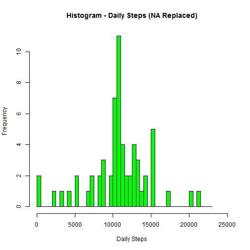

## Loading and preprocessing the data
Load CSV file assuming it is in the working directory. Set options for data
displays.

```r
        ## >=10^5 will show scientific notation
        ## show 2 digits of decimal precision
        options(scipen = 1, digits = 2)         

        data1<-read.csv("./activity.csv")
```

## What is mean total number of steps taken per day?
Determine the mean and median steps taken per day. NA values will be ignored.


```r
        ## group and sum by the date column
        stepsByDay<-with(data1,aggregate(steps,by=list(date),FUN=sum))
        names(stepsByDay)<-c("Date","Steps")
        
        hist(stepsByDay$Steps,breaks=seq(0,23000,by=500),xlim=c(0,25000),
                xlab="Daily Steps",main="Histogram - Daily Steps",
                col="red")
```

 

```r
        ## Get mean and median of daily steps, remove NA data
        stepsMean<-mean(stepsByDay$Steps, na.rm = TRUE)
        stepsMedian<-median(stepsByDay$Steps, na.rm = TRUE)
```

The mean steps per day is 10766.19. The median steps per day is 10765


## What is the average daily activity pattern?
Determine the average steps taken per day per interval group. NA values will be ignored.

```r
        ## Group and average by interval column
        stepsByInterval<-with(data1,aggregate(steps,by=list(interval),FUN=mean,
                na.rm=TRUE))
        names(stepsByInterval)<-c("Interval","AvgSteps")
        
        par(mfrow = c(1,1), mar=c(1,4,1,2), oma=c(1,1,1,1))
        plot(stepsByInterval$Interval,stepsByInterval$AvgSteps,type="l",
                xaxt="n",ylab="Average Steps",
                main="Time Series - Average Steps by 5-Minute Interval")
        axis(1, at = stepsByInterval$Interval)
```

 

```r
        ## Get max step value and its corresponding interval
        maxAvgSteps<-max(stepsByInterval$AvgSteps)
        maxInterval<-stepsByInterval[stepsByInterval$AvgSteps==maxAvgSteps,"Interval"]
```
The maximum average steps across all days is 206.17 and occurs in interval: 835


## Imputing missing values
Count number of missing step values. Make a new data set replacing missing values
with the average value for that specific interval across all days. The average value used for replacement will be rounded to an integer.

```r
        ## subset only the rows with steps = NA
        NAEntries<-data1[is.na(data1$steps),]
        NACount<-nrow(NAEntries) ## number of NA entries in data1

        ## Merge the original activity data (data1) with the previous 
        ## stepsByInterval data to align a replacement average steps per interval
        ## value to each row in data1 by corresponding interval column value 
        data2<-merge(data1,stepsByInterval,by.x="interval",
                 by.y="Interval",all.x=TRUE,all.y==FALSE)
        ## Replace the NA steps column values with the corresponding
        ## AvgSteps value rounded to an integer.       
        data2[is.na(data2$steps),"steps"]<-round(data2[is.na(data2$steps),"AvgSteps"],0)
                
        stepsByDay2<-with(data2,aggregate(steps,by=list(date),FUN=sum))
        names(stepsByDay2)<-c("Date","Steps")

        hist(stepsByDay2$Steps,breaks=seq(0,23000,by=500),xlim=c(0,25000),
                xlab="Daily Steps",col="green",
                main="Histogram - Daily Steps (NA Replaced)")
```

 

```r
        ## Get mean and median of daily steps, no NA data to remove        
        stepsMean2<-mean(stepsByDay2$Steps)
        stepsMedian2<-median(stepsByDay2$Steps)
```

There were 2304 NA values in the data set.

The mean steps per day after NA replacement with the average step value across all
data in the respective interval is 10765.64. The median steps per day is 10762. Both of these values decreased compared to the original data set which ignored the NA values. 


## Are there differences in activity patterns between weekdays and weekends?
Group the data set with NA replacement values by weekday or weekend. Plot the 
two data sets.

```r
        ## Add new factor variable DayType which will be "Weekday" or "weekend"
        data2$DayType<-""
        data2[weekdays(as.Date(data2[,"date"])) %in% 
                c("Monday","Tuesday","Wednesday","Thursday","Friday"),"DayType"]<-"weekday"
        data2[weekdays(as.Date(data2[,"date"])) %in% 
                c("Saturday","Sunday"),"DayType"]<-"weekend"
        
        ## Group and average by DayType and interval column
        stepsByInterval2<-with(data2,aggregate(steps,by=list(DayType,interval),FUN=mean))
        names(stepsByInterval2)<-c("DayType","Interval","AvgSteps")
        
        library(lattice)
        plot1<-xyplot(AvgSteps~Interval|DayType,data=stepsByInterval2,
                      main="Average Steps by 5-Minute Interval",
                      ylab="Average Steps",xlab="Interval (HH:MM)",type="l")
        print(plot1)
```

 


There appears to be less activity before 10AM on the weekend.
